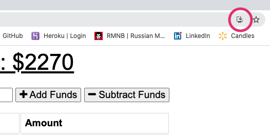
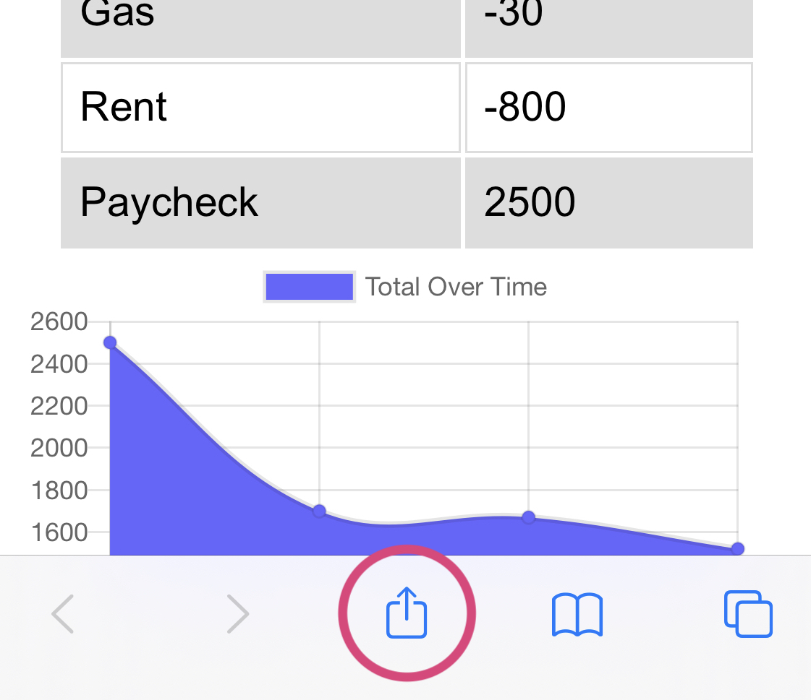
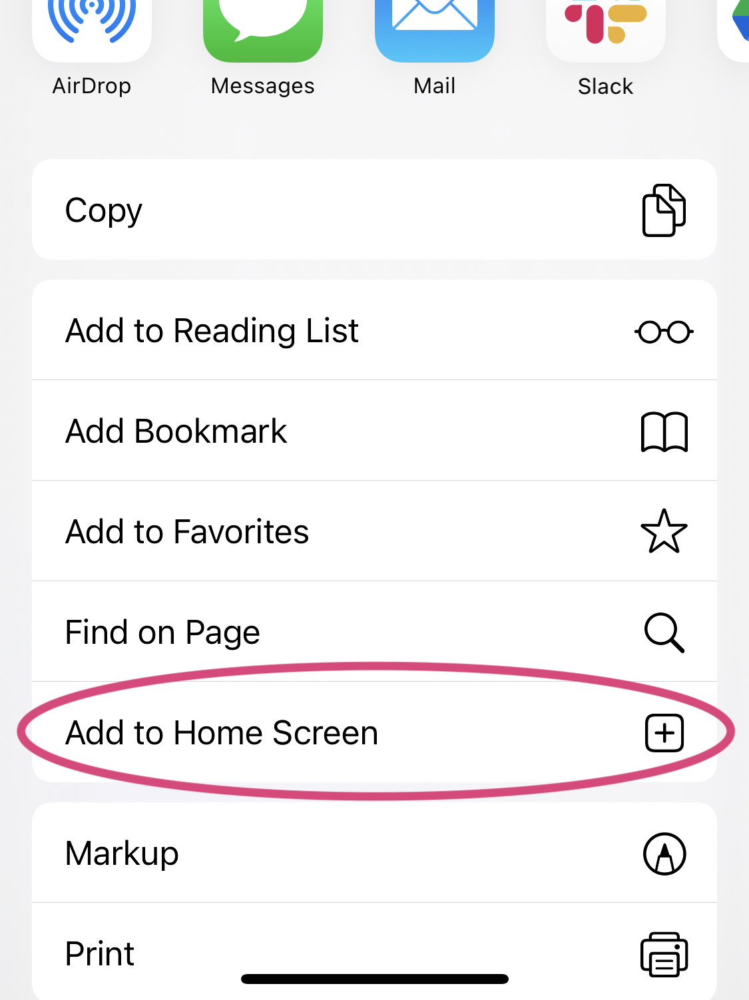
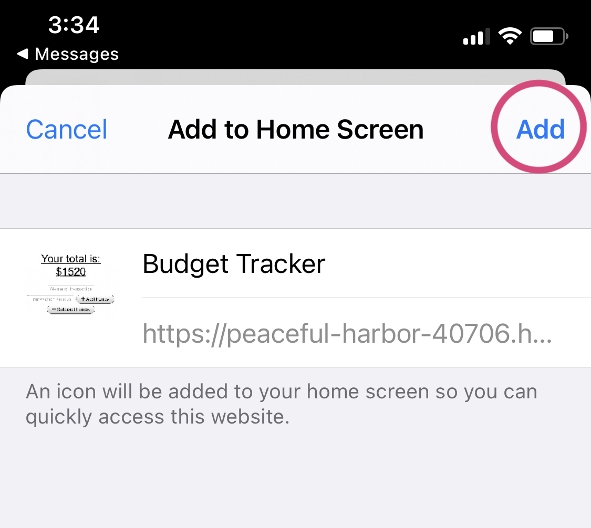
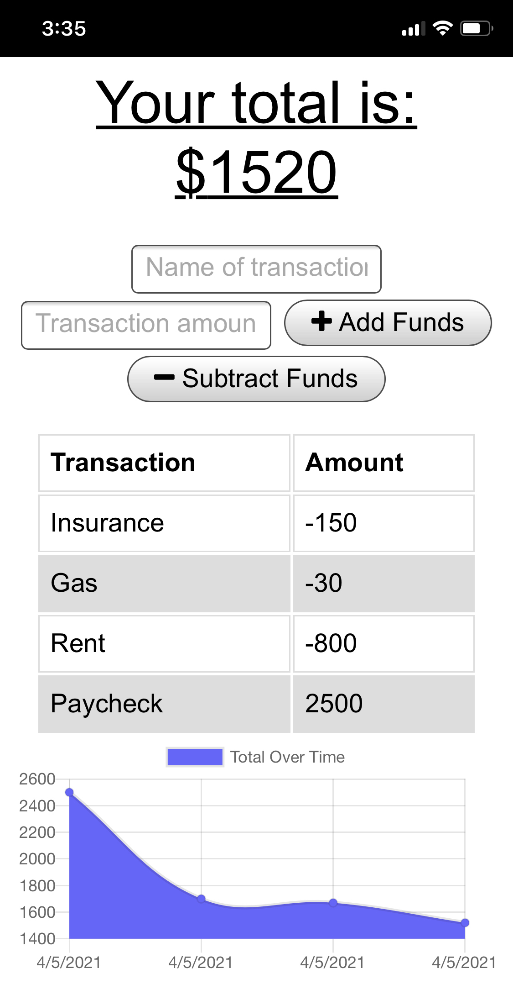
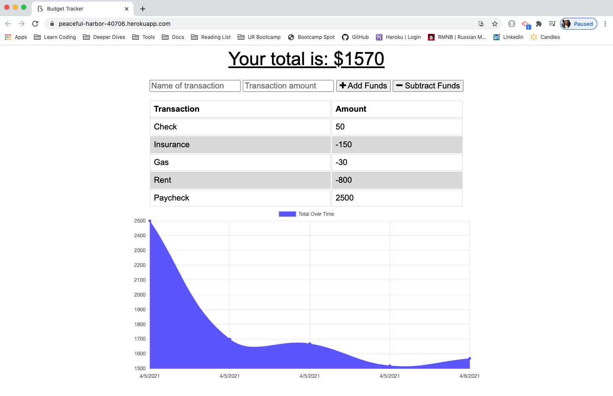

# Budget Tracker


## Table of Contents

- [Deployed Application](#deployed-application)
- [Description](#description)
- [Progressive Web Application Features](#progressive-web-application-features)
- [Technologies](#technologies)
- [Install for Development](#install-for-development)
- [Local Database Setup](#local-database-setup)
- [Usage](#usage)
- [Build](#build)
- [Install on Desktop (Chrome)](<#install-on-desktop-(chrome)>)
- [Install on Android (Chrome)](<#install-on-android-(chrome)>)
- [Install on iOS (Safari)](<#install-on-ios-(safari)>)
- [Application Demo](#application-demo)
- [License](#license)
- [Contact](#contact)

## Deployed Application

Visit the deployed application here: [Budget Tracker](https://peaceful-harbor-40706.herokuapp.com/)

## Description

The budget tracker is a minimalistic application for logging and charting financial transactions over time. Using a lightweight user interface, users can enter view a list of their previous transactions as well as a visual representation of those transactions plotted on a chart. Users can also add new transactions to the tracker and watch the user interface immediately update to reflect the changes.

## Progressive Web Application Features

Underneath the hood, this budget tracking application is actually a minimalistic **progressive web application**.

**Installable:**
Since the budget tracker uses cached assets and data to support offline functionality, the budget tracker can also be installed and interacted with outside of the browser as a desktop or mobile application. Once installed, the budget tracker will appear as an independent application that can be:

- Launched from the user's home screen, dock, or applications menu
- Included as an independent application in the user's multitasking or app switching tray
- Interacted with in the same way that other native applications on the user's device are

**Offline Functionality:**
By using the `Service Worker API` and the `Cache API` to cache static assets and API response data, users are able to view their transaction history as well as add new transactions regardless of whether their device is connected to a network or not. In the event that the device loses network connectivity, new transactions will be stored in the browser using the `IndexedDB API` and bulk added to the database when the network comes back online.


## Technologies

- HTML
- CSS
- JavaScript
- Node.js
- Express
- MongoDB
- Mongoose
- Webpack
- Babel

## Install for Development

While the application can be visited and interacted with at [here](#deployed-application), it can also be installed and configured to run locally using the steps below.

This application requires Node.js and npm to run locally. To check whether Node.js and npm are installed locally, run:

```
node -v
```

```
npm -v
```

If Node and npm are already installed, the commands above should return version numbers. Visit [Node.js](http://www.nodejs.org/) and [npm](https://docs.npmjs.com/downloading-and-installing-node-js-and-npm) for full installation details and documentation.

Running this application locally requires installation of the following dependencies: `express`, `mongoose`, `morgan`, and `compression`.

Additionally, running and testing the Budget Tracker locally requires the installation of a suite of devDependencies including `webpack`, `webpack-cli`, `webpack-pwa-manifest`, `babel-loader`, `@babel/core`, and `@babel/preset-env`. These modules are used to bundle and minify resources, generate the application's manifest and icons, and transpile ES6+ JavaScript down to ES5 friendly syntax.

To install the project and its npm dependencies, navigate to the project's root directory and run:

```
npm install
```

Once all third-party packages have been successfully installed, the application is ready to use.

For more details regarding production and development dependencies, reference the application's `package.json` file.

## Local Database Setup

This application uses a MongoDB database to store workout data. To run the application locally, MongoDB must be installed and configured locally. The deployed application uses MongoDB Atlas to store its data in the cloud. The application uses `mongoose.js` to define and enforce a schema on documents inserted into the `transactions` collection in the `budget` database. Each transaction is added to the database as a new document inside the `transactions` collection.

## Usage

Once npm packages have been installed and the database has been initialized, the application can be launched:

```
npm start
```

## Build

To create a new build using `webpack` and `babel`, run:

```
npm run build
```

Alternatively, `webpack` and `babel` can be run in the background on watch mode:

```
npm run watch
```

## Install on Desktop (Chrome)

**Install on Desktop using Chrome:**

- Navigate to the [live application](https://peaceful-harbor-40706.herokuapp.com/) using your device
- Find the `Install` button in the top right corner of the URL bar:  
  
- Follow the prompts to complete installation

## Install on Android (Chrome)

**Install on Android using Chrome:**

- Navigate to the [live application](https://peaceful-harbor-40706.herokuapp.com/) using your device
- Click the `Add to home screen` button
- Follow the prompts to complete installation

## Install on iOS (Safari)

**Install on iOS using Safari:**

- Navigate to the [live application](https://peaceful-harbor-40706.herokuapp.com/) using your device
- Tap the `Share` button:  
  
- Tap the `Add to Home Screen` button:  
  
- Review the details and tap the `Add` button:  
  
- The application can now be used outside of the browser as if it were a native iOS application:  
  

## Application Interface

The following screenshot shows the application's user interface in its only state:  



## License

Copyright (c) 2021 J.K. Royston  
Licensed under the [MIT License](https://opensource.org/licenses/MIT).

## Contact

J.K. Royston  
<jkroyston@gmail.com>  
[GitHub](https://www.github.com/jxhnkndl)
